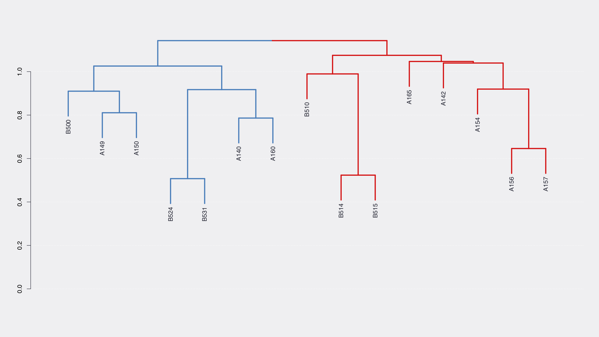
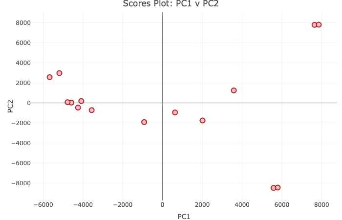
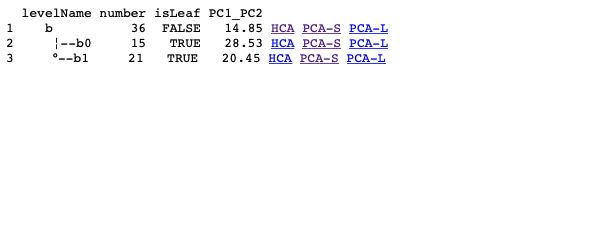

# hcapca

**hcapca** is an R script for performing Hierarchical Clustering Analysis (HCA) and Principal Component Analysis (PCA) on LC-MS data. It was tested on the following operating systems:
* macOS 10.14.4
* Ubuntu 18.04.2 LTS
* Windows 7
* Windows 10

# Demo


# Instructions

## 1. Install Docker
Install [Docker Community Edition (CE)](https://docs.docker.com/install) for your operating system. For older Mac and Windows systems, you will need to install [Docker Toolbox](https://docs.docker.com/toolbox/overview) instead.

## 2. Get example data, scripts, and config file
Example `data`, `R scripts`, and `config_file.yaml` can be found at [this link](https://uwmadison.box.com/v/schanana-hcapca). Please download and unzip to one place such that your directory structure looks like:

```
base
  |--config_file.yaml
  |--hcapca.R
  |--accessory_functions.R
  |--app.R
  |--data
      |--Analyses.dat
      |--Variables_m.dat
      |--Variables_t.dat
      |--Table.dat
```
You can use your own data instead of example data here. The format of each file must be like the example data.  
_Note: The <b><span style="color:blue">`base`</span></b> directory is where you unzip the `data` folder, `R scripts`, and `config_file.yaml`._

## 3.  Housekeeping:
* You must have administrator access to install Docker or Docker Toolbox.
* You should increase the memory limits to allow the script to run. I recommend 4 GB of RAM and 2 cores to run the example data. 
	* For **Windows 7**, open VirtualBox (installed as part of Docker Toolbox) from Start Menu as admin and stop the virtual machine `default` that is running. In settings for `default`, change the RAM and processor allocation.
    * For **Linux**, you don't need to do this since Docker has access to the entire system's resources.
    * For **Windows 10** and **macOS**, open the preferences from the Docker app and increase resources as needed.
* You must enable shared folders:
	* In **Windows 10**, you need to enable shared folders in preferences. Right click on the Docker icon in the system tray **>** settings **>** shared drives **>** check appropriate drives **>** Apply
	* In **Windows 7**, as before, access the VirutalBox as admin **>** stop the default virtual machine **>** go to settings for the virtual machine **>** Shared Folders **>** Add as needed
* For **Windows 7** please make a note of the IP address that is displayed when you first start the `Docker Quickstart Terminal`. Usually it is something like `192.168.99.100`. This will be important in step 5 below.

## 4. Run the script to process data
 #### 4.1 For macOS and Linux 
 Open a terminal, `cd` to the `base` directory and run:
  ```bash
  docker run --rm \
   --tty \
   --interactive \
   --volume $(pwd):/srv/shiny-server/hcapca:rw \
   --workdir /srv/shiny-server/hcapca \
   schanana/hcapca:latest hcapca.R
  ```
 #### 4.2 For Windows 10
Use the `Powershell` **(not x86 or ISE, just Powershell)** and type:
 ```powershell
 docker run --interactive `
   --tty `
   --rm `
   --volume //c/Users/username/path/to/base/directory:/srv/shiny-server/hcapca `
   --workdir /srv/shiny-server/hcapca `
   schanana/hcapca:latest hcapca.R
 ```
 Be sure to replace `/username/path/to/base/directory` in the above command with the path to the `base` directory.  

 #### 4.3 For Windows 7
Use the `Docker Quickstart Terminal`, `cd` to the `base` directory and run:
 ```bash
  docker run --interactive \
    --tty \
    --rm \
    --volume $(pwd):/srv/shiny-server/hcapca:rw \
    --workdir /srv/shiny-server/hcapca \
    schanana/hcapca:latest hcapca.R
  ```

### Regardless of OS, a folder called `output` should be created within the `base` directory with the following structure:
```
base
   |--output
         |--report.html
         |--hca
         |   |--lots_of.pdfs
         |
         |--pca
            |--names_with_underscores.html
            |--directories_with_the_same_names
```
If your config file has parameter `output_pca` as `FALSE`, then the `pca` folder will be empty. Do not worry, you can explore individual PCAs for each node in the next step.

## 5. Explore results
  #### 5.1 For macOS and Linux
  In the `base` run:
```bash
docker run --rm \
   --interactive \
   --tty \
   --name hcapca \
   --detach \
   --volume $(pwd):/srv/shiny-server/hcapca:rw \
   --workdir /srv/shiny-server/hcapca/ \
   --publish 3838:3838 \
   schanana/hcapca:latest
```
Navigate to **http://127.0.0.1:3838/hcapca** to view your results in an interactive website!

  #### 5.2 For Windows 10
Use the `Powershell` **(not x86 or ISE, just Powershell)** and type:
```powershell
docker run --rm `
   --interactive `
   --tty `
   --name hcapca `
   --detach `
   --volume //c/Users/<username>/path/to/base/directory:/srv/shiny-server/hcapca:rw `
   --workdir /srv/shiny-server/hcapca `
   --publish 3838:3838 `
   schanana/hcapca:latest
   ```
As before, replace `username/path/to/base/directory` with the path to the `base` directory and navigate to **http://127.0.0.1:3838/hcapca** to view your results in an interactive website!

 #### 5.3 For Windows 7
 On Windows 7, use the `Docker Quickstart Terminal` and in the `base` directory run:
 ```bash
 docker run --interactive \
   --tty \
   --rm \
   --detach \
   --name hcapca \
   --volume "$(pwd)":/srv/shiny-server/hcapca \
   --workdir /srv/shiny-server/hcapca \
   --publish 3838:3838 \
   schanana/hcapca:latest
 ```
Navigate to **http://your.ip:3838/hcapca** where you should replace `your.ip` with the ip shown when docker starts up - as mentioned in section #3 Housekeeping above.

## Table Format
#### 1. `Analyses.dat`
**Contains:** Sample names  
**Format:** One name per line; names can be any combination of letters and numbers. Duplicates will be removed.

    A123  
    B123  
    C122
    B455

#### 2. `Variables_m.dat`  
**Contains:** m/z values separated by spaces _all on one line_. Keep them in the same order as the retention time and table data.
    
    198.0390 758.3503 0.0000 395.1877 366.2404 ...

#### 3. `Variables_t.dat` 
**Contains:** retention time values (in minutes or seconds) separated by spaces _all on one line_. Keep them in the same order as the m/z and table data. 

    12.3 8.0 7.3 2.02 12.3 ...

#### 4. `Table.dat`
**Contains:** intensity values   
**Format:** Space separated values; numbers only. Each line contains the values corresponding to the sample names from `Analyses.dat` above.
    
    198.0390 758.3503 0.0000 395.1877 366.2404 ...
    438.1456 378.1118 435.0968 525.2830 0.0000 ...
    312.1296 349.1325 184.0433 0.0000 201.0702 ...
    425.0835 0.0000 311.1384 371.2302 337.0677 ...

  # Some Example outputs
  ##### 1. HCA
  `b0-15.pdf` HCA of node b0 with 15 samples  
  
  ##### 2. PCA  
  `b0_PC1-2_S.html` PCA Scores plot of b0 for PC1 and PC2
  
  <!--##### 3. Report  
  `report.html` Sample of report with links
  
  -->

# Troubleshooting:
* In some flavors of **Windows**, there may be an error in mounting a shared drive. If that happens, try the following:
   * Make sure the path is specified as `//<drive_letter>/<path>`
   * Make sure the shared drives are enabled and that particular path is shared
   * Make sure the terminal is running as administrator

* Docker abruptly stops running the script
  * Make sure to allocate sufficient RAM and processing power to Docker. Usually, if the virual OS cannot get more memory, it experiences an Out Of Memory (OOM) error and kills the offending process thereby exiting the container.

* For any issues please open an issue here on github or email me at schanana@wisc.edu
  
# Wiki
[Here](https://github.com/chanana/hcapca/wiki) is a link to wiki page which is still under construction.

# License
This project is licensed under the [GNU General Public License v3.0](https://tldrlegal.com/license/gnu-general-public-license-v3-(gpl-3)) - please see the [LICENSE.md](LICENSE.md) file for full license.

# Acknowledgments
A huge thank you to Chris Thomas for helping bring this idea to fruition by being a wall to bounce off ideas. He does not have a github account so [here is a link](https://www.ncbi.nlm.nih.gov/pubmed/?term=Thomas%5BAuthor%5D%20AND%20Bugni%5BAuthor%5D&cmd=DetailsSearch) to a pubmed search with his publications. Another big thank you to [@cecileane](https://github.com/cecileane) for pointing me in the right direction to generate a tree from a dataframe. Finally, a shoutout to [@WiscEvan](https://github.com/WiscEvan) for helping figure out bits and pieces of code here and there, especially with the shiny UX.
